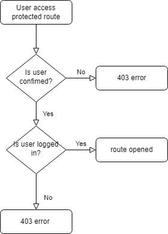

# Implementation of Authentication and Authorization APIs in Javascript
Dealing with the security of APIs can be tricky, as handling users' data has be done with the utmost care and responsibility across any platform or organization.

Employing the use of redis as a separate caching database for tokens reduces the workload on MySQL, thus improving the performance of the application. The system is simple, and is represented in the diagram below:

Whenever a user's access token is expired, the application automatically generates a new access token if the refresh token of the user is still valid.
The  client is assigned a refresh token which is cached in the redis database. Using the jsonwebtoken library, a confirmation procedure is followed upon client's request to a protected route as seen here [users.js](./src/routes/users.js) See line 23.
